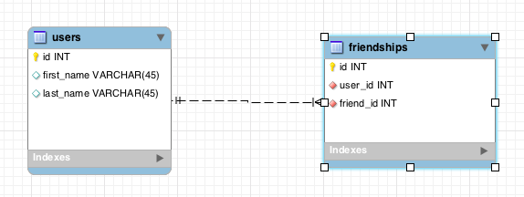

# README

## Amigos

Dado el siguiente ERD:



Piensa en una forma de hacer lo siguiente:

### Crea proyecto y modelos
~~~
rails new amigos

rails g model user first_name:string last_name:string --force
rails g model friendship user:references friend_id:integer --force

rake db:migrate
rake db:migrate:status
~~~

| Status |  Migration ID   | Migration Name     |
|--------|-----------------|--------------------|
|   up   |  20210725043535 | Create users       |
|   up   |  20210725044534 | Create friendships |


### Agrega relaciones entre los modelos

***app/models/user.rb***
~~~
class User < ActiveRecord::Base
    has_many :friendships
    has_many :friends, :through => :friendships
end
~~~

***app/models/friendship.rb***
~~~
class Friendship < ActiveRecord::Base
    belongs_to :user
    belongs_to :friend, :class_name => "User"
end
~~~

### Crea registros para User

~~~
apellido = [
    'González',
    'Muñoz',
    'Rojas',
    'Díaz',
    'Pérez',
    'Soto',
    'Contreras',
    'Silva',
    'Martínez',
    'Sepúlveda',
    'Morales',
    'Rodríguez',
    'López',
    'Fuentes',
    'Hernández'
]

nombre = ['Mateo',
    'Isabella',
    'Sofía',
    'Agustina',
    'Agustín',
    'Santiago',
    'Emilia',
    'Tomás',
    'Benjamín',
    'Lucas',
    'Josefa',
    'Isidora',
    'Emma',
    'Trinidad',
    'Gaspar'
]

(1..30).each do |i|
    User.create(first_name: nombre[rand(0...nombre.length)], last_name: apellido[rand(0...apellido.length)])
end

User.all
~~~

| id | first_name | last_name | created_at              | updated_at              |
|----|------------|-----------|-------------------------|-------------------------|
| 1  | Trinidad   | Contreras | 2021-07-25 04:47:07 UTC | 2021-07-25 04:47:07 UTC |
| 2  | Isabella   | Díaz      | 2021-07-25 04:47:07 UTC | 2021-07-25 04:47:07 UTC |
| 3  | Trinidad   | López     | 2021-07-25 04:47:07 UTC | 2021-07-25 04:47:07 UTC |
| 4  | Isabella   | Pérez     | 2021-07-25 04:47:07 UTC | 2021-07-25 04:47:07 UTC |
| 5  | Tomás      | Díaz      | 2021-07-25 04:47:07 UTC | 2021-07-25 04:47:07 UTC |
| 6  | Emma       | González  | 2021-07-25 04:47:07 UTC | 2021-07-25 04:47:07 UTC |
| 7  | Gaspar     | Contreras | 2021-07-25 04:47:07 UTC | 2021-07-25 04:47:07 UTC |
| 8  | Sofía      | Rodríguez | 2021-07-25 04:47:07 UTC | 2021-07-25 04:47:07 UTC |
| 9  | Santiago   | Martínez  | 2021-07-25 04:47:07 UTC | 2021-07-25 04:47:07 UTC |
| 10 | Mateo      | González  | 2021-07-25 04:47:07 UTC | 2021-07-25 04:47:07 UTC |
| 11 | Emma       | Contreras | 2021-07-25 04:47:07 UTC | 2021-07-25 04:47:07 UTC |
| 12 | Tomás      | Rojas     | 2021-07-25 04:47:07 UTC | 2021-07-25 04:47:07 UTC |
| 13 | Isidora    | Pérez     | 2021-07-25 04:47:07 UTC | 2021-07-25 04:47:07 UTC |
| 14 | Emma       | Contreras | 2021-07-25 04:47:07 UTC | 2021-07-25 04:47:07 UTC |
| 15 | Agustina   | López     | 2021-07-25 04:47:07 UTC | 2021-07-25 04:47:07 UTC |
| 16 | Isidora    | Pérez     | 2021-07-25 04:47:07 UTC | 2021-07-25 04:47:07 UTC |
| 17 | Emilia     | Muñoz     | 2021-07-25 04:47:07 UTC | 2021-07-25 04:47:07 UTC |
| 18 | Trinidad   | López     | 2021-07-25 04:47:07 UTC | 2021-07-25 04:47:07 UTC |
| 19 | Agustina   | Silva     | 2021-07-25 04:47:07 UTC | 2021-07-25 04:47:07 UTC |
| 20 | Josefa     | Rodríguez | 2021-07-25 04:47:07 UTC | 2021-07-25 04:47:07 UTC |
| 21 | Gaspar     | Morales   | 2021-07-25 04:47:07 UTC | 2021-07-25 04:47:07 UTC |
| 22 | Isabella   | Soto      | 2021-07-25 04:47:07 UTC | 2021-07-25 04:47:07 UTC |
| 23 | Benjamín   | Contreras | 2021-07-25 04:47:07 UTC | 2021-07-25 04:47:07 UTC |
| 24 | Benjamín   | Sepúlveda | 2021-07-25 04:47:07 UTC | 2021-07-25 04:47:07 UTC |
| 25 | Emilia     | Silva     | 2021-07-25 04:47:07 UTC | 2021-07-25 04:47:07 UTC |
| 26 | Tomás      | Martínez  | 2021-07-25 04:47:07 UTC | 2021-07-25 04:47:07 UTC |
| 27 | Tomás      | Soto      | 2021-07-25 04:47:07 UTC | 2021-07-25 04:47:07 UTC |
| 28 | Santiago   | Morales   | 2021-07-25 04:47:07 UTC | 2021-07-25 04:47:07 UTC |
| 29 | Gaspar     | Soto      | 2021-07-25 04:47:07 UTC | 2021-07-25 04:47:07 UTC |
| 30 | Tomás      | López     | 2021-07-25 04:47:07 UTC | 2021-07-25 04:47:07 UTC |


### Crea registros para Friendship

~~~
(1..7).each {|i| Friendship.create(user:User.first, friend:User.find(i*5))}
Friendship.all
~~~

| id | user_id | friend_id | created_at              | updated_at              |
|----|---------|-----------|-------------------------|-------------------------|
| 1  | 1       | 5         | 2021-07-25 04:51:16 UTC | 2021-07-25 04:51:16 UTC |
| 2  | 1       | 10        | 2021-07-25 04:51:16 UTC | 2021-07-25 04:51:16 UTC |
| 3  | 1       | 15        | 2021-07-25 04:51:16 UTC | 2021-07-25 04:51:16 UTC |
| 4  | 1       | 20        | 2021-07-25 04:51:16 UTC | 2021-07-25 04:51:16 UTC |
| 5  | 1       | 25        | 2021-07-25 04:51:16 UTC | 2021-07-25 04:51:16 UTC |
| 6  | 1       | 30        | 2021-07-25 04:51:16 UTC | 2021-07-25 04:51:16 UTC |

### Querys

1- Usuario.first debe recuperar la información del primer usuario.

```User.first```

| id | first_name | last_name | created_at              | updated_at              |
|----|------------|-----------|-------------------------|-------------------------|
| 1  | Trinidad   | Contreras | 2021-07-25 04:47:07 UTC | 2021-07-25 04:47:07 UTC |

2- Usuario.first.amigos debería mostrar toda la información de los amigos del primer usuario (esto debe incluir el nombre y apellido de todos los amigos de Usuario.first).

```User.first.friends```

| id | first_name | last_name | created_at              | updated_at              |
|----|------------|-----------|-------------------------|-------------------------|
| 5  | Tomás      | Díaz      | 2021-07-25 04:47:07 UTC | 2021-07-25 04:47:07 UTC |
| 10 | Mateo      | González  | 2021-07-25 04:47:07 UTC | 2021-07-25 04:47:07 UTC |
| 15 | Agustina   | López     | 2021-07-25 04:47:07 UTC | 2021-07-25 04:47:07 UTC |
| 20 | Josefa     | Rodríguez | 2021-07-25 04:47:07 UTC | 2021-07-25 04:47:07 UTC |
| 25 | Emilia     | Silva     | 2021-07-25 04:47:07 UTC | 2021-07-25 04:47:07 UTC |
| 30 | Tomás      | López     | 2021-07-25 04:47:07 UTC | 2021-07-25 04:47:07 UTC |

3- Encuentre la forma de obtener todos los usuarios que NO son amigos del primer usuario.

```User.where.not(id:Friendship.where(user:User.find(1)).select(:friend_id))```

| id | first_name | last_name | created_at              | updated_at              |
|----|------------|-----------|-------------------------|-------------------------|
| 1  | Trinidad   | Contreras | 2021-07-25 04:47:07 UTC | 2021-07-25 04:47:07 UTC |
| 2  | Isabella   | Díaz      | 2021-07-25 04:47:07 UTC | 2021-07-25 04:47:07 UTC |
| 3  | Trinidad   | López     | 2021-07-25 04:47:07 UTC | 2021-07-25 04:47:07 UTC |
| 4  | Isabella   | Pérez     | 2021-07-25 04:47:07 UTC | 2021-07-25 04:47:07 UTC |
| 6  | Emma       | González  | 2021-07-25 04:47:07 UTC | 2021-07-25 04:47:07 UTC |
| 7  | Gaspar     | Contreras | 2021-07-25 04:47:07 UTC | 2021-07-25 04:47:07 UTC |
| 8  | Sofía      | Rodríguez | 2021-07-25 04:47:07 UTC | 2021-07-25 04:47:07 UTC |
| 9  | Santiago   | Martínez  | 2021-07-25 04:47:07 UTC | 2021-07-25 04:47:07 UTC |
| 11 | Emma       | Contreras | 2021-07-25 04:47:07 UTC | 2021-07-25 04:47:07 UTC |
| 12 | Tomás      | Rojas     | 2021-07-25 04:47:07 UTC | 2021-07-25 04:47:07 UTC |
| 13 | Isidora    | Pérez     | 2021-07-25 04:47:07 UTC | 2021-07-25 04:47:07 UTC |
| 14 | Emma       | Contreras | 2021-07-25 04:47:07 UTC | 2021-07-25 04:47:07 UTC |
| 16 | Isidora    | Pérez     | 2021-07-25 04:47:07 UTC | 2021-07-25 04:47:07 UTC |
| 17 | Emilia     | Muñoz     | 2021-07-25 04:47:07 UTC | 2021-07-25 04:47:07 UTC |
| 18 | Trinidad   | López     | 2021-07-25 04:47:07 UTC | 2021-07-25 04:47:07 UTC |
| 19 | Agustina   | Silva     | 2021-07-25 04:47:07 UTC | 2021-07-25 04:47:07 UTC |
| 21 | Gaspar     | Morales   | 2021-07-25 04:47:07 UTC | 2021-07-25 04:47:07 UTC |
| 22 | Isabella   | Soto      | 2021-07-25 04:47:07 UTC | 2021-07-25 04:47:07 UTC |
| 23 | Benjamín   | Contreras | 2021-07-25 04:47:07 UTC | 2021-07-25 04:47:07 UTC |
| 24 | Benjamín   | Sepúlveda | 2021-07-25 04:47:07 UTC | 2021-07-25 04:47:07 UTC |
| 26 | Tomás      | Martínez  | 2021-07-25 04:47:07 UTC | 2021-07-25 04:47:07 UTC |
| 27 | Tomás      | Soto      | 2021-07-25 04:47:07 UTC | 2021-07-25 04:47:07 UTC |
| 28 | Santiago   | Morales   | 2021-07-25 04:47:07 UTC | 2021-07-25 04:47:07 UTC |
| 29 | Gaspar     | Soto      | 2021-07-25 04:47:07 UTC | 2021-07-25 04:47:07 UTC |


## Info adicional

Hasta ahora nuestros modelos han podido hacer referencia al modelo asociado sin ningún tipo de problemas 

(ej. rails g model Blog usuario:references). Por lo general, tenemos una columna como usuario que hace referencia a la clase Usuario y nos permite consultar desdel el Blog el usuario que creó ese Blog (ej. Blog.first.usuario.name). Sin embargo, con esta actividad vamos a tener una columna amigos que hace referencia a la clase ¿Amigos?. Espera, eso no parece estar correcto. Nuestra columna amigo debería hacer referencia a Usuario a través de nuestra tabla Amistades. De esta forma podemos utilizar nuestra tabla Amistades para especificar que nuestro amigo debe pertenecer a la clas "Usuario". Esto permitirá que nuestra referencia vuelva a apuntar a un objeto de usuario (es decir Usuario.first.amigos).


**¡Estudia un poco más!**

[http://guides.rubyonrails.org/association_basics.html#self-joins](http://guides.rubyonrails.org/association_basics.html#self-joins)

[http://guides.rubyonrails.org/association_basics.html#the-has-many-through-association](http://guides.rubyonrails.org/association_basics.html#the-has-many-through-association)


