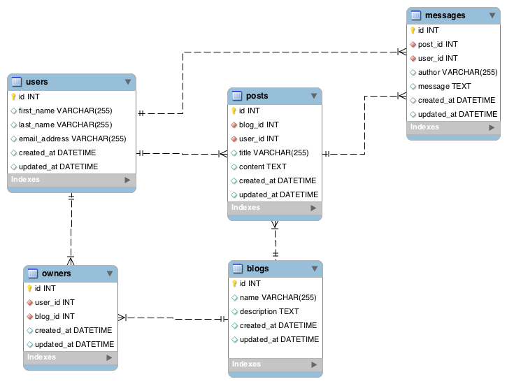

# README

## Blogs/Publicaciones/Mensajes II

Nuestro blog se volvió un poco más complicado. Vamos a hacer todo nuestro blog privado y solo permitiremos que ciertos usuarios accedan a diferentes blogs. También vamos a permitir el registro de usuarios para dejar mensajes. Aquí está el nuevo ERD:




Antes de hacer esto, por favor lea: [http://guides.rubyonrails.org/associationbasics.html#the-hasmany-through-association](http://guides.rubyonrails.org/associationbasics.html#the-hasmany-through-association)

**ACLARACIÓN**: Cuando hagas estas actividades, cuando indicamos que queremos obtener todas la publicaciones del Usuario 1, nos estamos refiriendo a todos los blog **que son propiedad** del Usuario 1 y NO a los blog donde el Usuario 1 ha escrito publicaciones. 

Distinguir esto es muy importante.

Basado en el nuevo diagrama:

Cree los modelos apropiados.

~~~
rails new blog_pubs_msjes_ii

rails g scaffold Blog name:string description:text
rails g scaffold User first_name:string last_name:string email_address:string

rails g scaffold Post title:string content:text blog:references user:references
rails g model Owner blog:references user:references

rails g scaffold Message author:string messag:text post:references user:references

rake db:migrate
~~~

```rake db:migrate:status```

| Status |  Migration ID   | Migration Name  |
|--------|-----------------|-----------------|
|   up   |  20210723032426 | Create blogs    |
|   up   |  20210723032432 | Create users    |
|   up   |  20210723032436 | Create posts    |
|   up   |  20210723032441 | Create owners   |
|   up   |  20210724231336 | Create messages |

Cree las validaciones apropiadas (piensa en los campos que vas a requerir, que otra regla de validación necesitarías).

* user.rb:

    ~~~
    class User < ApplicationRecord
        has_many :owner
        has_many :blog, through: :owner

        has_many :post
        has_many :blog, through: :post

        has_many :message
        
        validates :first_name, :last_name, presence: true
        EMAIL_REGEX = /\A([^@\s]+)@((?:[-a-z0-9]+\.)+[a-z]+)\z/i
        validates :email_address, presence: true, uniqueness: { case_sensitive: false }, format: { with: EMAIL_REGEX }
    end
    ~~~

* post.rb:

    ~~~
    class Post < ApplicationRecord
        belongs_to :blog
        belongs_to :user

        has_many :message
        # has_many :user, through: :message

        validates :title, presence: true
    end
    ~~~

* message.rb:

    ~~~
    class Message < ApplicationRecord
        belongs_to :post
        belongs_to :user

        validates :author, presence: true
    end
    ~~~

* blog.rb:

    ~~~
    class Blog < ApplicationRecord
        has_many :owner
        has_many :user, through: :owner

        has_many :post
        has_many :user, through: :post

        validates :name, presence: true
    end
    ~~~

* owner.rb:

    ~~~
    class Owner < ApplicationRecord
        belongs_to :blog
        belongs_to :user
    end
    ~~~

**Usando la consola...**

 * Crear 5 Usuarios.

    ~~~
    User.new(first_name:"Bill", last_name:"Gates", email_address:"bill.gates@msoft.com").save
    User.new(first_name:"Steve", last_name:"Jobs", email_address:"steve_mac@mac.com").save
    User.new(first_name:"Jeff", last_name:"Bezos", email_address:"amazon@jbezos.com").save
    User.new(first_name:"Elon", last_name:"Musk", email_address:"irontesla@tesla.com").save
    User.new(first_name:"Mark", last_name:"Zuckerberg ", email_address:"face_book@mz.com").save

    User.all
    ~~~

    | id | first_name | last_name   | email_address        | created_at              | updated_at              |
    |----|------------|-------------|----------------------|-------------------------|-------------------------|
    | 1  | Bill       | Gates       | bill.gates@msoft.com | 2021-07-24 23:16:16 UTC | 2021-07-24 23:16:16 UTC |
    | 2  | Steve      | Jobs        | steve_mac@mac.com    | 2021-07-24 23:16:16 UTC | 2021-07-24 23:16:16 UTC |
    | 3  | Jeff       | Bezos       | amazon@jbezos.com    | 2021-07-24 23:16:16 UTC | 2021-07-24 23:16:16 UTC |
    | 4  | Elon       | Musk        | irontesla@tesla.com  | 2021-07-24 23:16:17 UTC | 2021-07-24 23:16:17 UTC |
    | 5  | Mark       | Zuckerberg  | face_book@mz.com     | 2021-07-24 23:16:17 UTC | 2021-07-24 23:16:17 UTC |

 * Crear 5 blogs.

    ~~~
    Blog.new(name:"CodingDojo Blog", description:"Blog Principal de Coding Dojo").save
    Blog.new(name:"Coding Ruby on Rails", description:"Blog sobre Ruby on Rails (RoR)").save
    Blog.new(name:"Coding Python Django", description:"Blog sobre Python + Django").save
    Blog.new(name:"Coding JavaScript", description:"Blog sobre JavaScript").save
    Blog.new(name:"Coding HTML - CSS", description:"Blog sobre HTML y CSS").save

    Blog.all
    ~~~

    | id | name                 | description                    | created_at              | updated_at              |
    |----|----------------------|--------------------------------|-------------------------|-------------------------|
    | 1  | CodingDojo Blog      | Blog Principal de Coding Dojo  | 2021-07-24 23:16:58 UTC | 2021-07-24 23:16:58 UTC |
    | 2  | Coding Ruby on Rails | Blog sobre Ruby on Rails (RoR) | 2021-07-24 23:16:58 UTC | 2021-07-24 23:16:58 UTC |
    | 3  | Coding Python Django | Blog sobre Python + Django     | 2021-07-24 23:16:58 UTC | 2021-07-24 23:16:58 UTC |
    | 4  | Coding JavaScript    | Blog sobre JavaScript          | 2021-07-24 23:16:59 UTC | 2021-07-24 23:16:59 UTC |
    | 5  | Coding HTML - CSS    | Blog sobre HTML y CSS          | 2021-07-24 23:17:05 UTC | 2021-07-24 23:17:05 UTC |

 * Haz que los primeros 3 blogs pertenezcan al primer usuario.

    ~~~
    Owner.new(blog:Blog.first, user:User.first).save
    Owner.new(blog:Blog.second, user:User.first).save
    Owner.new(blog:Blog.third, user:User.first).save

    Owner.all
    ~~~

    | id | blog_id | user_id | created_at              | updated_at              |
    |----|---------|---------|-------------------------|-------------------------|
    | 1  | 1       | 1       | 2021-07-24 23:17:41 UTC | 2021-07-24 23:17:41 UTC |
    | 2  | 2       | 1       | 2021-07-24 23:17:42 UTC | 2021-07-24 23:17:42 UTC |
    | 3  | 3       | 1       | 2021-07-24 23:17:57 UTC | 2021-07-24 23:17:57 UTC |

 * Haz que el cuarto blog que crea pertenezca al segundo usuario.

    ~~~
    Owner.new(blog:Blog.find(4), user:User.second).save

    Owner.all
    ~~~

    | id | blog_id | user_id | created_at              | updated_at              |
    |----|---------|---------|-------------------------|-------------------------|
    | 1  | 1       | 1       | 2021-07-24 23:17:41 UTC | 2021-07-24 23:17:41 UTC |
    | 2  | 2       | 1       | 2021-07-24 23:17:42 UTC | 2021-07-24 23:17:42 UTC |
    | 3  | 3       | 1       | 2021-07-24 23:17:57 UTC | 2021-07-24 23:17:57 UTC |
    | 4  | 4       | 2       | 2021-07-24 23:18:34 UTC | 2021-07-24 23:18:34 UTC |

 * Haz que el quinto blog que crea pertenezca al último usuario.

    ~~~
    Owner.new(blog:Blog.find(5), user:User.last).save

    Owner.all
    ~~~

    | id | blog_id | user_id | created_at              | updated_at              |
    |----|---------|---------|-------------------------|-------------------------|
    | 1  | 1       | 1       | 2021-07-24 23:17:41 UTC | 2021-07-24 23:17:41 UTC |
    | 2  | 2       | 1       | 2021-07-24 23:17:42 UTC | 2021-07-24 23:17:42 UTC |
    | 3  | 3       | 1       | 2021-07-24 23:17:57 UTC | 2021-07-24 23:17:57 UTC |
    | 4  | 4       | 2       | 2021-07-24 23:18:34 UTC | 2021-07-24 23:18:34 UTC |
    | 5  | 5       | 5       | 2021-07-24 23:18:53 UTC | 2021-07-24 23:18:53 UTC |

 * Haz que el tercer usuario sea el propietario de todos los blogs que se crearon.

    ~~~
    Blog.all.each do |b|
        puts Owner.new(blog:b, user:User.third).save
    end

    Owner.all
    ~~~

    | id | blog_id | user_id | created_at              | updated_at              |
    |----|---------|---------|-------------------------|-------------------------|
    | 1  | 1       | 1       | 2021-07-24 23:17:41 UTC | 2021-07-24 23:17:41 UTC |
    | 2  | 2       | 1       | 2021-07-24 23:17:42 UTC | 2021-07-24 23:17:42 UTC |
    | 3  | 3       | 1       | 2021-07-24 23:17:57 UTC | 2021-07-24 23:17:57 UTC |
    | 4  | 4       | 2       | 2021-07-24 23:18:34 UTC | 2021-07-24 23:18:34 UTC |
    | 5  | 5       | 5       | 2021-07-24 23:18:53 UTC | 2021-07-24 23:18:53 UTC |
    | 6  | 1       | 3       | 2021-07-24 23:19:51 UTC | 2021-07-24 23:19:51 UTC |
    | 7  | 2       | 3       | 2021-07-24 23:19:51 UTC | 2021-07-24 23:19:51 UTC |
    | 8  | 3       | 3       | 2021-07-24 23:19:51 UTC | 2021-07-24 23:19:51 UTC |
    | 9  | 4       | 3       | 2021-07-24 23:19:51 UTC | 2021-07-24 23:19:51 UTC |
    | 10 | 5       | 3       | 2021-07-24 23:19:51 UTC | 2021-07-24 23:19:51 UTC |

 * Haz que el primer usuario cree tres publicaciones para el blog con id = 2. Recuerde que no debe hacer Publicacion.create(usuario: Usuario first, blog_id: 2), sino algo como Publicacion.create(usuario: Usuario.first, blog: Blog.find(2)). Repito, nunca se debe hacer referencia a las claves foráneas en Rails.  

    ~~~
    title = [
        "Lenguajes de Programacion",
        "FrameWorks JS",
        "Full Stack Development"]

    content = "Lorem Ipsum is simply dummy text of the printing and typesetting industry."
        
    title.each do |t|
        Post.new(title:t, content:content, blog:Blog.find(2), user:User.first).save
    end

    Post.all
    ~~~

    | id | title                     | content                                     | blog_id | user_id | created_at              | updated_at              |
    |----|---------------------------|---------------------------------------------|---------|---------|------------------------|--------------------------|
    | 1  | Lenguajes de Programacion | Lorem Ipsum is simply dummy text of the ... | 2       | 1       | 2021-07-24 23:20:22 UTC | 2021-07-24 23:20:22 UTC |
    | 2  | FrameWorks JS             | Lorem Ipsum is simply dummy text of the ... | 2       | 1       | 2021-07-24 23:20:22 UTC | 2021-07-24 23:20:22 UTC |
    | 3  | Full Stack Development    | Lorem Ipsum is simply dummy text of the ... | 2       | 1       | 2021-07-24 23:20:22 UTC | 2021-07-24 23:20:22 UTC |


 * Haz que el segundo usuario cree 5 publicaciones para el último blog.  

    ~~~
    title = [
        "Introducción al HTML",
        "Introducción a CSS",
        "Boostrap",
        "Plantillas de Boostrap",
        "Fundamentos de SASS"]

    content = "Lorem Ipsum is simply dummy text of the printing and typesetting industry."
        
    title.each do |t|
        Post.new(title:t, content:content, blog:Blog.last, user:User.second).save
    end

    Post.all
    ~~~

    | id | title                     | content                                 | blog_id | user_id | created_at              | updated_at              |
    |----|---------------------------|-----------------------------------------|---------|---------|-------------------------|-------------------------|
| 1  | Lenguajes de Programacion | Lorem Ipsum is simply dummy text of the ... | 2       | 1       | 2021-07-24 23:20:22 UTC | 2021-07-24 23:20:22 UTC |
| 2  | FrameWorks JS             | Lorem Ipsum is simply dummy text of the ... | 2       | 1       | 2021-07-24 23:20:22 UTC | 2021-07-24 23:20:22 UTC |
| 3  | Full Stack Development    | Lorem Ipsum is simply dummy text of the ... | 2       | 1       | 2021-07-24 23:20:22 UTC | 2021-07-24 23:20:22 UTC |
| 4  | Introducción al HTML      | Lorem Ipsum is simply dummy text of the ... | 5       | 2       | 2021-07-24 23:21:13 UTC | 2021-07-24 23:21:13 UTC |
| 5  | Introducción a CSS        | Lorem Ipsum is simply dummy text of the ... | 5       | 2       | 2021-07-24 23:21:13 UTC | 2021-07-24 23:21:13 UTC |
| 6  | Boostrap                  | Lorem Ipsum is simply dummy text of the ... | 5       | 2       | 2021-07-24 23:21:13 UTC | 2021-07-24 23:21:13 UTC |
| 7  | Plantillas de Boostrap    | Lorem Ipsum is simply dummy text of the ... | 5       | 2       | 2021-07-24 23:21:13 UTC | 2021-07-24 23:21:13 UTC |
| 8  | Fundamentos de SASS       | Lorem Ipsum is simply dummy text of the ... | 5       | 2       | 2021-07-24 23:21:13 UTC | 2021-07-24 23:21:13 UTC |

 * Haz que el tercer usuario cree varias publicaciones en diferentes blogs.

    ~~~
    title = [
        "Lorem Ipsum I",
        "Lorem Ipsum II",
        "Lorem Ipsum III",
        "Lorem Ipsum IV",
        "Lorem Ipsum V"
        ]

    content = "Lorem Ipsum is simply dummy text of the printing and typesetting industry."
        
    title.each do |t|
        puts Post.new(title:t, content:content, blog:Blog.find(rand(1..5)), user:User.third).save
    end

    Post.all
    ~~~

    | id | title                     | content                                             | blog_id | user_id | created_at              | updated_at              |
    |----|---------------------------|-----------------------------------------------------|---------|---------|-------------------------|-------------------------|
    | 1  | Lenguajes de Programacion | Lorem Ipsum is simply dummy text of the printing... | 2       | 1       | 2021-07-24 23:20:22 UTC | 2021-07-24 23:20:22 UTC |
    | 2  | FrameWorks JS             | Lorem Ipsum is simply dummy text of the printing... | 2       | 1       | 2021-07-24 23:20:22 UTC | 2021-07-24 23:20:22 UTC |
    | 3  | Full Stack Development    | Lorem Ipsum is simply dummy text of the printing... | 2       | 1       | 2021-07-24 23:20:22 UTC | 2021-07-24 23:20:22 UTC |
    | 4  | Introducción al HTML      | Lorem Ipsum is simply dummy text of the printing... | 5       | 2       | 2021-07-24 23:21:13 UTC | 2021-07-24 23:21:13 UTC |
    | 5  | Introducción a CSS        | Lorem Ipsum is simply dummy text of the printing... | 5       | 2       | 2021-07-24 23:21:13 UTC | 2021-07-24 23:21:13 UTC |
    | 6  | Boostrap                  | Lorem Ipsum is simply dummy text of the printing... | 5       | 2       | 2021-07-24 23:21:13 UTC | 2021-07-24 23:21:13 UTC |
    | 7  | Plantillas de Boostrap    | Lorem Ipsum is simply dummy text of the printing... | 5       | 2       | 2021-07-24 23:21:13 UTC | 2021-07-24 23:21:13 UTC |
    | 8  | Fundamentos de SASS       | Lorem Ipsum is simply dummy text of the printing... | 5       | 2       | 2021-07-24 23:21:13 UTC | 2021-07-24 23:21:13 UTC |
    | 9  | Lorem Ipsum I             | Lorem Ipsum is simply dummy text of the printing... | 5       | 3       | 2021-07-24 23:22:16 UTC | 2021-07-24 23:22:16 UTC |
    | 10 | Lorem Ipsum II            | Lorem Ipsum is simply dummy text of the printing... | 5       | 3       | 2021-07-24 23:22:16 UTC | 2021-07-24 23:22:16 UTC |
    | 11 | Lorem Ipsum III           | Lorem Ipsum is simply dummy text of the printing... | 5       | 3       | 2021-07-24 23:22:16 UTC | 2021-07-24 23:22:16 UTC |
    | 12 | Lorem Ipsum IV            | Lorem Ipsum is simply dummy text of the printing... | 5       | 3       | 2021-07-24 23:22:16 UTC | 2021-07-24 23:22:16 UTC |
    | 13 | Lorem Ipsum V             | Lorem Ipsum is simply dummy text of the printing... | 1       | 3       | 2021-07-24 23:22:16 UTC | 2021-07-24 23:22:16 UTC |

 * Haz que el tercer usuario cree 2 mensajes para la primera publicación creada y 3 mensajes para la segunda publicación creada.  Haz que el cuarto usuario cree 3 mensajes para la última publicación que tu creaste.  

    ~~~
    def nombre_all us
        "#{us.first_name} #{us.last_name}"
    end

    us3 = User.third
    us4 = User.find(4)

    [1,1,2,2,2].each do |p|
        Message.new(author: nombre_all(us3), messag:content, post:Post.find(p), user:us3).save
    end

    [1,1,1].each do |p|
        Message.new(author: nombre_all(us4), messag:content, post:Post.last, user:us4).save
    end

    Message.all
    ~~~

    | id | author     | messag                                                   | post_id | user_id | created_at              | updated_at              |
    |----|------------|----------------------------------------------------------|---------|---------|-------------------------|-------------------------|
    | 1  | Jeff Bezos | Lorem Ipsum is simply dummy text of the printing and ... | 1       | 3       | 2021-07-24 23:24:39 UTC | 2021-07-24 23:24:39 UTC |
    | 2  | Jeff Bezos | Lorem Ipsum is simply dummy text of the printing and ... | 1       | 3       | 2021-07-24 23:24:39 UTC | 2021-07-24 23:24:39 UTC |
    | 3  | Jeff Bezos | Lorem Ipsum is simply dummy text of the printing and ... | 2       | 3       | 2021-07-24 23:24:39 UTC | 2021-07-24 23:24:39 UTC |
    | 4  | Jeff Bezos | Lorem Ipsum is simply dummy text of the printing and ... | 2       | 3       | 2021-07-24 23:24:39 UTC | 2021-07-24 23:24:39 UTC |
    | 5  | Jeff Bezos | Lorem Ipsum is simply dummy text of the printing and ... | 2       | 3       | 2021-07-24 23:24:39 UTC | 2021-07-24 23:24:39 UTC |
    | 6  | Elon Musk  | Lorem Ipsum is simply dummy text of the printing and ... | 13      | 4       | 2021-07-24 23:24:40 UTC | 2021-07-24 23:24:40 UTC |
    | 7  | Elon Musk  | Lorem Ipsum is simply dummy text of the printing and ... | 13      | 4       | 2021-07-24 23:24:40 UTC | 2021-07-24 23:24:40 UTC |
    | 8  | Elon Musk  | Lorem Ipsum is simply dummy text of the printing and ... | 13      | 4       | 2021-07-24 23:24:40 UTC | 2021-07-24 23:24:40 UTC |

 * Cambie el propietario de la 2 publicación para que sea el último usuario.  

    ```Post.second.user```

    | id | first_name | last_name | email_address        | created_at              | updated_at              |
    |----|------------|-----------|----------------------|-------------------------|-------------------------|
    | 1  | Bill       | Gates     | bill.gates@msoft.com | 2021-07-24 23:16:16 UTC | 2021-07-24 23:16:16 UTC |

    ~~~
    Post.second.update(user: User.last)
    Post.second.user
    ~~~

    | id | first_name | last_name   | email_address    | created_at              | updated_at              |
    |----|------------|-------------|------------------|-------------------------|-------------------------|
    | 5  | Mark       | Zuckerberg  | face_book@mz.com | 2021-07-24 23:16:17 UTC | 2021-07-24 23:16:17 UTC |


 * Cambie el contenido de la segunda publicación por algo diferente.

    ~~~
    Post.second.content => "Lorem Ipsum is simply dummy text of the printing and typesetting industry."

    Post.second.update(content: "Modificacion al Lorem Impsum")

    Post.second.content => "Modificacion al Lorem Impsum"
    ~~~

 * Obtenga todos los blog que son propiedad del tercer usuario (haz que esto funcione con un simple Usuario.find(3).blogs).

    ~~~
    User.find(3).owner
    ~~~

    | id | blog_id | user_id | created_at              | updated_at              |
    |----|---------|---------|-------------------------|-------------------------|
    | 6  | 1       | 3       | 2021-07-24 23:19:51 UTC | 2021-07-24 23:19:51 UTC |
    | 7  | 2       | 3       | 2021-07-24 23:19:51 UTC | 2021-07-24 23:19:51 UTC |
    | 8  | 3       | 3       | 2021-07-24 23:19:51 UTC | 2021-07-24 23:19:51 UTC |
    | 9  | 4       | 3       | 2021-07-24 23:19:51 UTC | 2021-07-24 23:19:51 UTC |
    | 10 | 5       | 3       | 2021-07-24 23:19:51 UTC | 2021-07-24 23:19:51 UTC |

 * Obtenga todas las publicaciones que fueron creadas por el tercer usuario.  

    ```User.find(3).post```

    | id | title           | content                                                  | blog_id | user_id | created_at              | updated_at              |
    |----|-----------------|----------------------------------------------------------|---------|---------|-------------------------|-------------------------|
    | 9  | Lorem Ipsum I   | Lorem Ipsum is simply dummy text of the printing and ... | 5       | 3       | 2021-07-24 23:22:16 UTC | 2021-07-24 23:22:16 UTC |
    | 10 | Lorem Ipsum II  | Lorem Ipsum is simply dummy text of the printing and ... | 5       | 3       | 2021-07-24 23:22:16 UTC | 2021-07-24 23:22:16 UTC |
    | 11 | Lorem Ipsum III | Lorem Ipsum is simply dummy text of the printing and ... | 5       | 3       | 2021-07-24 23:22:16 UTC | 2021-07-24 23:22:16 UTC |
    | 12 | Lorem Ipsum IV  | Lorem Ipsum is simply dummy text of the printing and ... | 5       | 3       | 2021-07-24 23:22:16 UTC | 2021-07-24 23:22:16 UTC |
    | 13 | Lorem Ipsum V   | Lorem Ipsum is simply dummy text of the printing and ... | 1       | 3       | 2021-07-24 23:22:16 UTC | 2021-07-24 23:22:16 UTC |

 * Obtenga todos los mensajes escritos por el tercer usuario.  

     ```User.find(3).message```

    | id | author     | messag                                               | post_id | user_id | created_at              | updated_at              |
    |----|------------|------------------------------------------------------|---------|---------|-------------------------|-------------------------|
    | 1  | Jeff Bezos | Lorem Ipsum is simply dummy text of the printing ... | 1       | 3       | 2021-07-24 23:24:39 UTC | 2021-07-24 23:24:39 UTC |
    | 2  | Jeff Bezos | Lorem Ipsum is simply dummy text of the printing ... | 1       | 3       | 2021-07-24 23:24:39 UTC | 2021-07-24 23:24:39 UTC |
    | 3  | Jeff Bezos | Lorem Ipsum is simply dummy text of the printing ... | 2       | 3       | 2021-07-24 23:24:39 UTC | 2021-07-24 23:24:39 UTC |
    | 4  | Jeff Bezos | Lorem Ipsum is simply dummy text of the printing ... | 2       | 3       | 2021-07-24 23:24:39 UTC | 2021-07-24 23:24:39 UTC |
    | 5  | Jeff Bezos | Lorem Ipsum is simply dummy text of the printing ... | 2       | 3       | 2021-07-24 23:24:39 UTC | 2021-07-24 23:24:39 UTC |

 * Obtenga todas las publicaciones asociadas al blog con id = 5 y quién dejó cada publicación. 

    ```Post.joins(:blog).joins(:user).where(blog_id: 5).select(:id ,:name, :title, :first_name, :last_name)```

    | id | title                  | name              | first_name | last_name |
    |----|------------------------|-------------------|------------|-----------|
    | 4  | Introducción al HTML   | Coding HTML - CSS | Steve      | Jobs      |
    | 5  | Introducción a CSS     | Coding HTML - CSS | Steve      | Jobs      |
    | 6  | Boostrap               | Coding HTML - CSS | Steve      | Jobs      |
    | 7  | Plantillas de Boostrap | Coding HTML - CSS | Steve      | Jobs      |
    | 8  | Fundamentos de SASS    | Coding HTML - CSS | Steve      | Jobs      |
    | 9  | Lorem Ipsum I          | Coding HTML - CSS | Jeff       | Bezos     |
    | 10 | Lorem Ipsum II         | Coding HTML - CSS | Jeff       | Bezos     |
    | 11 | Lorem Ipsum III        | Coding HTML - CSS | Jeff       | Bezos     |
    | 12 | Lorem Ipsum IV         | Coding HTML - CSS | Jeff       | Bezos     |

 * Obtenga todos los mensajes asociados al blog con id = 5, junto con toda la información de los usuarios que dejaron mensajes. 

    Al generar los mensajes de manera aleatoria no se generó ninguno en el Blog id=5

    ~~~
    Post.joins(:blog).where(blog_id: 5).joins(:message).select('id', 'title', 'author', 'messag')

    Post Load (2.1ms)  SELECT "posts"."id", "posts"."title", author, messag FROM "posts" INNER JOIN "blogs" ON "blogs"."id" = "posts"."blog_id" INNER JOIN "messages" ON "messages"."post_id" = "posts"."id" WHERE "posts"."blog_id" = ?  [["blog_id", 5]]
    => #<ActiveRecord::Relation []>
    ~~

    El Blod id=1 tiene mensajes que se muestran a continuación.

    ~~~
    Post.joins(:blog).where(blog_id: 1).joins(:message).select('id', 'title', 'author', 'messag')
    ~~~

    | id | title         | author    | messag                                                                     |
    |----|---------------|-----------|----------------------------------------------------------------------------|
    | 13 | Lorem Ipsum V | Elon Musk | Lorem Ipsum is simply dummy text of the printing and typesetting industry. |
    | 13 | Lorem Ipsum V | Elon Musk | Lorem Ipsum is simply dummy text of the printing and typesetting industry. |
    | 13 | Lorem Ipsum V | Elon Musk | Lorem Ipsum is simply dummy text of the printing and typesetting industry. |


 * Obtenga toda la información de los usuarios que son propietarios del primer blog (haz que esto funcione con un simple Blog.first.propietarios)

    ```Blog.first.owner.joins(:user).select('id', 'first_name', 'last_name', 'email_address')```

    | id | first_name | last_name | email_address        |
    |----|------------|-----------|----------------------|
    | 1  | Bill       | Gates     | bill.gates@msoft.com |
    | 6  | Jeff       | Bezos     | amazon@jbezos.com    |

 * Cámbielo, es decir, el primer usuario ya no es propietario del primer blog.

    ~~~
    Blog.first.owner.joins(:user).select('id', 'first_name', 'last_name', 'email_address').first.delete
    Blog.first.owner.joins(:user).select('id', 'first_name', 'last_name', 'email_address')
    ~~~

    | id | first_name | last_name | email_address        |
    |----|------------|-----------|----------------------|
    | 6  | Jeff       | Bezos     | amazon@jbezos.com    |    

    ```Owner.all```

    | id | blog_id | user_id | created_at              | updated_at              |
    |----|---------|---------|-------------------------|-------------------------|
    | 2  | 2       | 1       | 2021-07-24 23:17:42 UTC | 2021-07-24 23:17:42 UTC |
    | 3  | 3       | 1       | 2021-07-24 23:17:57 UTC | 2021-07-24 23:17:57 UTC |
    | 4  | 4       | 2       | 2021-07-24 23:18:34 UTC | 2021-07-24 23:18:34 UTC |
    | 5  | 5       | 5       | 2021-07-24 23:18:53 UTC | 2021-07-24 23:18:53 UTC |
    | 6  | 1       | 3       | 2021-07-24 23:19:51 UTC | 2021-07-24 23:19:51 UTC |
    | 7  | 2       | 3       | 2021-07-24 23:19:51 UTC | 2021-07-24 23:19:51 UTC |
    | 8  | 3       | 3       | 2021-07-24 23:19:51 UTC | 2021-07-24 23:19:51 UTC |
    | 9  | 4       | 3       | 2021-07-24 23:19:51 UTC | 2021-07-24 23:19:51 UTC |
    | 10 | 5       | 3       | 2021-07-24 23:19:51 UTC | 2021-07-24 23:19:51 UTC |


## Polimorfismo

Vamos a agregar otro modelo (Comentario) a nuestra actividad Blogs/Publicaciones/Mensajes. Digamos que queremos permitir a los usuarios dejar comentarios ya sea para un usuario, un blog, una publicación o un mensaje. En lugar de crear una nueva tabla Comentario para cada elemento (ej. usuario_comentarios, blog_comentarios, publicacion_comentario, mensaje_comentarios), solo necesitamos crear una simple tabla comentarios que especifique para cuál modelo/tabla (usuario, blog, publicacion, mensaje) es el comentario.

Agregue un nuevo modelo para la actividad anterior donde ahora el modelo llamado Comentario puede tener comentarios para un usuario, un blog, una publicación o un mensaje.

~~~
rails g model Comment content_comm:string comm:references{polymorphic}

rake db:migrate
~~~

```rake db:migrate:status```

| Status | Migration ID    | Migration Name  |
|--------|-----------------|-----------------|
|   up   |  20210723032426 | Create blogs    |
|   up   |  20210723032432 | Create users    |
|   up   |  20210723032436 | Create posts    |
|   up   |  20210723032441 | Create owners   |
|   up   |  20210724231336 | Create messages |
|   up   |  20210725010301 | Create comments |


***app/models/comment.rb***
~~~
class Comment < ApplicationRecord
  belongs_to :comm, polymorphic: true
end
~~~

***app/models/blog.rb***
~~~
class Blog < ApplicationRecord
    has_many :owner
    has_many :user, through: :owner

    has_many :post
    has_many :user, through: :post

    has_many :comments, as: :comm

    validates :name, presence: true
end
~~~

***app/models/message.rb***
~~~
class Message < ApplicationRecord
  belongs_to :post
  belongs_to :user

  has_many :comments, as: :comm

  validates :author, presence: true
end
~~~

***app/models/owner.rb***
~~~
class Owner < ApplicationRecord
  belongs_to :blog
  belongs_to :user

  has_many :comments, as: :comm
end
~~~

***app/models/post.rb***
~~~
class Post < ApplicationRecord
  belongs_to :blog
  belongs_to :user

  has_many :message
  # has_many :user, through: :message

  has_many :comments, as: :comm

  validates :title, presence: true
end
~~~

***app/models/user.rb***
~~~
class User < ApplicationRecord
    has_many :owner
    has_many :blog, through: :owner

    has_many :post
    has_many :blog, through: :post

    has_many :message

    has_many :comments, as: :comm
    
    validates :first_name, :last_name, presence: true
    EMAIL_REGEX = /\A([^@\s]+)@((?:[-a-z0-9]+\.)+[a-z]+)\z/i
    validates :email_address, presence: true, uniqueness: { case_sensitive: false }, format: { with: EMAIL_REGEX }
end
~~~

Compruébelo utilizando la consola y asegúrate que te permite agregar, actualizar y eliminar  comentarios para un usuario, un blog, una publicación o un mensaje.

* Se crean 4 comentarios aleatorios:

    ~~~
    Comment.create(content_comm:"Numero aleatorio: #{rand(1..1000)}", comm: User.find(rand(1..User.all.length)))
    Comment.create(content_comm:"Numero aleatorio: #{rand(1..1000)}", comm: Blog.find(rand(1..Blog.all.length)))
    Comment.create(content_comm:"Numero aleatorio: #{rand(1..1000)}", comm: Post.find(rand(1..Post.all.length)))
    Comment.create(content_comm:"Numero aleatorio: #{rand(1..1000)}", comm: Message.find(rand(1..Message.all.length)))

    Comment.all
    ~~~

    | id | content_comm          | comm_type | comm_id | created_at              | updated_at              |
    |----|-----------------------|-----------|---------|-------------------------|-------------------------|
    | 1  | Numero aleatorio: 704 | User      | 4       | 2021-07-25 01:13:22 UTC | 2021-07-25 01:13:22 UTC |
    | 2  | Numero aleatorio: 446 | Blog      | 1       | 2021-07-25 01:13:23 UTC | 2021-07-25 01:13:23 UTC |
    | 3  | Numero aleatorio: 305 | Post      | 13      | 2021-07-25 01:13:24 UTC | 2021-07-25 01:13:24 UTC |
    | 4  | Numero aleatorio: 142 | Message   | 7       | 2021-07-25 01:13:24 UTC | 2021-07-25 01:13:24 UTC |


* Actualización de datos (segundo comentario):

    ~~~
    Comment.second.update(content_comm:"Actualización num aleatorio: #{rand(1..1000)}")

    Comment.all
    ~~~

    | id | content_comm                     | comm_type | comm_id | created_at              | updated_at              |
    |----|----------------------------------|-----------|---------|-------------------------|-------------------------|
    | 1  | Numero aleatorio: 704            | User      | 4       | 2021-07-25 01:13:22 UTC | 2021-07-25 01:13:22 UTC |
    | 2  | Actualización num aleatorio: 408 | Blog      | 1       | 2021-07-25 01:13:23 UTC | 2021-07-25 01:18:22 UTC |
    | 3  | Numero aleatorio: 305            | Post      | 13      | 2021-07-25 01:13:24 UTC | 2021-07-25 01:13:24 UTC |
    | 4  | Numero aleatorio: 142            | Message   | 7       | 2021-07-25 01:13:24 UTC | 2021-07-25 01:13:24 UTC |


* Eliminar registro (tercer comentario):

    ~~~
    Comment.third.delete

    Comment.all
    ~~~

    | id | content_comm                     | comm_type | comm_id | created_at              | updated_at              |
    |----|----------------------------------|-----------|---------|-------------------------|-------------------------|
    | 1  | Numero aleatorio: 704            | User      | 4       | 2021-07-25 01:13:22 UTC | 2021-07-25 01:13:22 UTC |
    | 2  | Actualización num aleatorio: 408 | Blog      | 1       | 2021-07-25 01:13:23 UTC | 2021-07-25 01:18:22 UTC |
    | 4  | Numero aleatorio: 142            | Message   | 7       | 2021-07-25 01:13:24 UTC | 2021-07-25 01:13:24 UTC |